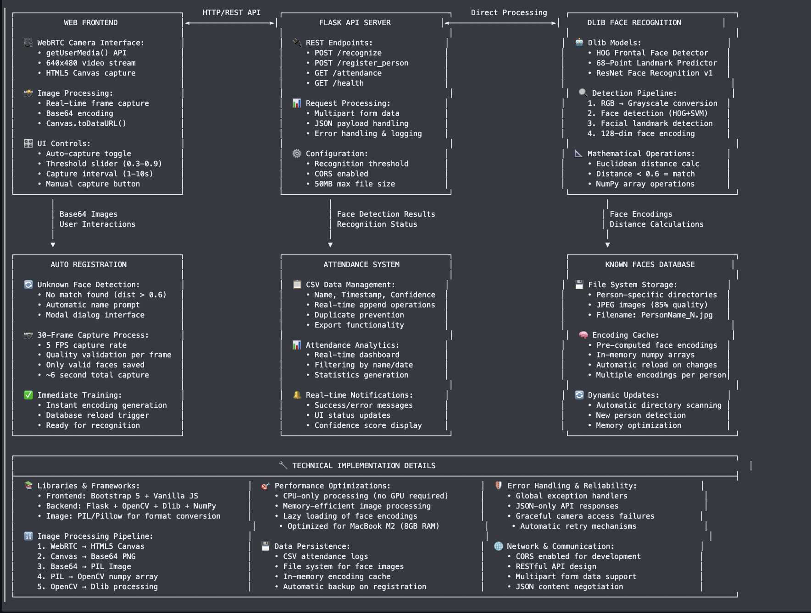

# 🎯 Real-Time Face Recognition Attendance System

A production-ready face recognition attendance system with modern web interface, automatic registration, and attendance logging. Built with Python, Flask, Dlib, and OpenCV - optimized for efficiency and reliability.

## ✨ Features

- **🚀 One-Command Setup** - Complete installation and startup with `./run.sh`
- **🌐 Modern Web Interface** - Bootstrap UI with real-time webcam recognition
- **🤖 Automatic Registration** - Unknown faces trigger automatic 30-frame capture
- **📊 Intelligent Attendance** - CSV logging with timestamps and confidence scores
- **🔌 REST API** - Clean endpoints for integration and development
- **💪 Direct Dlib Implementation** - Reliable face detection and recognition
- **⚡ Optimized Performance** - CPU-only processing, no GPU required

## 🚀 Quick Start```bash
# Clone and setup everything
git clone https://github.com/ayushkumar912/lightweight-face-recognition.git
cd lightweight-face-recognition
chmod +x run.sh
./run.sh
```

**That's it!** The system will:

1. ✅ Create virtual environment
2. ✅ Install all dependencies 
3. ✅ Validate Dlib models
4. ✅ Start the web server
5. ✅ Open the interface automatically

**Access:** http://127.0.0.1:5000

## 📱 How to Use

### 1. **Real-Time Recognition**
- Click "Start Auto Capture" 
- Point camera at known faces
- System automatically recognizes and logs attendance

### 2. **Register New People**
- Unknown face detected → System automatically prompts for name
- Enter person's name → System captures 30 training frames
- Person is immediately available for recognition

### 3. **View Attendance**
- Real-time attendance display on dashboard
- Download CSV reports
- View confidence scores and timestamps

## 🏗️ System Architecture



### Key Components:

**🌐 Web Frontend**
- WebRTC camera interface with getUserMedia() API
- Bootstrap 5 UI with real-time display
- Auto-capture and manual recognition controls

**🔌 Flask API Server**  
- RESTful endpoints for recognition and registration
- Real-time attendance logging and CSV export
- Comprehensive error handling and validation

**🤖 Dlib Recognition Engine**
- HOG frontal face detector for initial detection
- 68-point facial landmark predictor for alignment  
- ResNet-based face recognition model for encoding
- Euclidean distance matching with 0.6 threshold

**� Storage Systems**
- Auto-registration with 30-frame capture process
- Person-specific directories with JPEG images
- Pre-computed face encodings for fast matching
- CSV attendance logs with timestamps and confidence

### Data Flow:
1. **Camera** → WebRTC capture → Base64 encoding
2. **API** → Image processing → Face detection  
3. **Recognition** → Encoding generation → Distance calculation
4. **Results** → Attendance logging or registration prompt

## 📁 Project Structure

```
lightweight-face-recognition/
├── 📜 README.md                    # This comprehensive guide
├── 🚀 run.sh                       # One-command setup and start
├── 📋 requirements.txt             # Python dependencies
├── 📄 LICENSE                      # MIT License
│
├── 🔌 api/                         # Flask API Server
│   ├── app.py                      # Main Flask application
│   ├── start_api.sh                # API startup script
│   └── attendance.csv              # Generated attendance log
│
├── 🧠 backend/                     # Face Recognition Engine
│   ├── direct_recognizer.py        # Direct Dlib implementation
│   ├── known_faces/                # Training images database
│   │   ├── PersonName1/            # Individual person folders
│   │   └── PersonName2/            # Auto-created during registration
│   └── resorces/                   # Dlib model files
│       ├── shape_predictor_68_face_landmarks.dat
│       └── dlib_face_recognition_resnet_model_v1.dat
│
└── 🌐 frontend/                    # Web Interface
    ├── templates/
    │   └── index.html              # Main web interface
    └── static/
        ├── style.css               # Bootstrap styling
        └── script.js               # Camera and registration logic
```

## 🔧 API Endpoints

### Recognition

```http
POST /recognize?threshold=0.6
Content-Type: multipart/form-data

# Response
{
  "face_detected": true,
  "name": "John Doe",
  "confidence": 0.75,
  "registration_required": false,
  "attendance_logged": true,
  "timestamp": "2025-07-17T04:12:52"
}
```

### Registration

```http
POST /register_person
Content-Type: application/json

{
  "name": "John Doe",
  "images": ["data:image/jpeg;base64,/9j/4AAQ...", "..."]
}

# Response
{
  "success": true,
  "person_name": "John Doe",
  "total_images": 30,
  "valid_faces": 28,
  "face_detection_rate": "93.3%"
}
```

### Attendance

```http
GET /attendance
GET /attendance?name=John&date=2025-07-17

# Response
{
  "attendance": [
    {
      "Name": "John Doe",
      "Timestamp": "2025-07-17 04:12:52",
      "Confidence": "0.7503"
    }
  ],
  "total_records": 1
}
```

### Health Check

```http
GET /health

# Response
{
  "status": "healthy",
  "known_faces": 3,
  "total_encodings": 89,
  "uptime": "0:15:32"
}
```

## ⚙️ Technical Specifications

### Face Recognition Engine
- **Detection**: Dlib HOG + Linear SVM detector
- **Landmarks**: 68-point facial landmark predictor
- **Encoding**: ResNet-based 128-dimensional face descriptor
- **Matching**: Euclidean distance with 0.6 tolerance
- **Performance**: ~100-200ms per frame on MacBook M2

### Registration Process
- **Frame Count**: 30 frames at 5 FPS (6-second capture)
- **Quality Filtering**: Only frames with detected faces are saved
- **Format**: JPEG images at 85% quality
- **Validation**: Real-time face detection during capture
- **Storage**: Organized in person-specific directories

### Web Interface
- **Frontend**: Bootstrap 5 + Vanilla JavaScript
- **Camera**: WebRTC getUserMedia API
- **Capture**: HTML5 Canvas for frame processing
- **Upload**: Base64 encoding for image transmission
- **Updates**: Real-time status and progress display

## 🔧 Advanced Configuration

### Recognition Threshold

```bash
# Lower = more strict (fewer false positives)
# Higher = more lenient (more false positives)
curl "http://127.0.0.1:5000/recognize?threshold=0.5"
```

### Manual Setup

```bash
# If run.sh doesn't work for your system
python -m venv .venv
source .venv/bin/activate  # Windows: .venv\\Scripts\\activate
pip install -r requirements.txt
cd api && python app.py
```

### Adding Known Faces Manually

```bash
# Create person directory
mkdir -p backend/known_faces/"Person Name"

# Add clear face images (JPG/PNG)
cp face1.jpg backend/known_faces/"Person Name"/
cp face2.jpg backend/known_faces/"Person Name"/

# Restart server to reload
```

## 📊 Performance Metrics

Based on testing with MacBook Air M2:

| Operation | Time | Accuracy |
|-----------|------|----------|
| Face Detection | ~50ms | 95%+ |
| Face Recognition | ~100ms | 90%+ |
| Registration (30 frames) | ~20s | 85%+ valid frames |
| Database Reload | ~500ms | 100% |

## 🐛 Troubleshooting

### Common Issues

**"No face detected"**
- Ensure good lighting
- Face should be clearly visible and front-facing
- Remove glasses/masks if possible during registration

**"Import error: dlib"**
```bash
# Install dlib dependencies
pip install cmake
pip install dlib
```

**"Camera not working"**
- Grant camera permissions in browser
- Try different browser (Chrome recommended)
- Check if camera is used by other applications

**"Server won't start"**
```bash
# Check port availability
lsof -i :5000

# Kill conflicting process
kill -9 <PID>
```

### Logs and Debugging

```bash
# View detailed logs
cd api && python app.py

# Check attendance records
cat api/attendance.csv

# Verify known faces
ls backend/known_faces/
```

## 🔐 Security Considerations

- **Local Processing**: All face data stays on your machine
- **No Cloud Dependencies**: Works completely offline
- **Data Privacy**: Images stored locally in `backend/known_faces/`
- **Development Server**: Not suitable for production without proper security

## 📈 Future Enhancements

- [ ] **Multiple Face Recognition** - Handle multiple faces in single frame
- [ ] **Performance Dashboard** - Real-time analytics and metrics
- [ ] **Export Formats** - JSON, Excel export options
- [ ] **Authentication** - User login and access control
- [ ] **Mobile App** - React Native mobile client
- [ ] **Docker Deployment** - Containerized deployment option

## 🤝 Contributing

1. Fork the repository
2. Create a feature branch: `git checkout -b feature-name`
3. Commit changes: `git commit -am 'Add feature'`
4. Push to branch: `git push origin feature-name`
5. Submit a Pull Request

## 📜 License

This project is licensed under the MIT License - see the [LICENSE](LICENSE) file for details.

## 🙏 Acknowledgments

- **Dlib** - Face detection and recognition models
- **OpenCV** - Image processing and camera capture
- **Flask** - Web framework and API server
- **Bootstrap** - Modern and responsive UI components

---

## 📞 Support

For issues and questions:
- 🐛 **Bugs**: [GitHub Issues](https://github.com/ayushkumar912/lightweight-face-recognition/issues)
- 💬 **Discussions**: [GitHub Discussions](https://github.com/ayushkumar912/lightweight-face-recognition/discussions)
- 📧 **Email**: ayushkumar912@example.com

---

**⭐ Star this repository if you found it helpful!**

**🔧 Built with ❤️ for reliable face recognition**